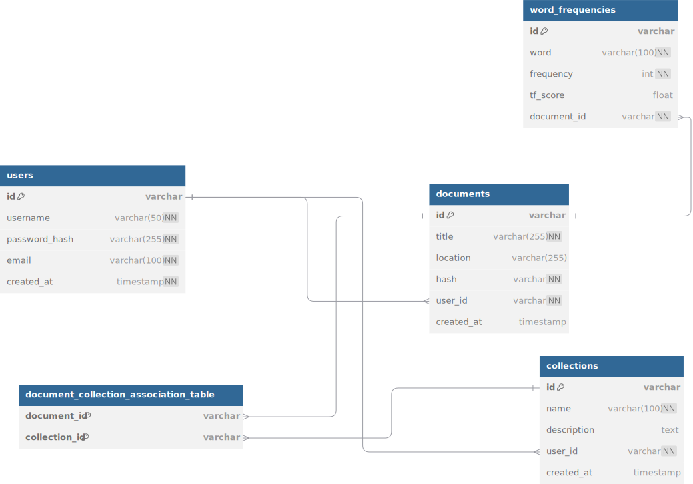

# TFIDF

Веб-приложение для загрузки текстовых файлов и анализа их содержимого с использованием алгоритма **TF-IDF**.

### Специфика реализации
Возможность создания пользовательских профилей, авторизации в них, создание коллекций и загрузка документов. 
Документ может находиться в нескольких коллекциях одновременно. Файлы хранятся на диске, записи о них в БД. Файл может
быть загружен пользователем, если файл принадлежит ему.


## ВЕРСИЯ 1.1.0

## Структура проекта

Приложение реализовано с помощью фреймворка FastAPI. Данные о загруженных файлах и их содержимом хранятся в базе данных PostgreSQL. Метрики хранятся в Valkey (Opensource Redis).

## Установка и запуск
1. Клонируйте репозиторий:
   ```bash
   git clone git@github.com:FwuffFox/TFIDF.git
    cd TFIDF
    ```
2. Скопируйте файл `.env.example` в `.env` и настройте параметры подключения к базе данных и Valkey:
   ```bash
   cp .env.example .env
   ```
3. Если установлен Docker, запустите контейнеры с помощью Docker Compose:
   ```bash
   docker-compose up --build
   ```
   Это создаст и запустит контейнеры для приложения, базы данных PostgreSQL и Valkey.
4. Если Docker не установлен, установите PostgreSQL и Valkey локально, затем используйте uv для установки зависимостей и запуска приложения:
   ```bash
   uv sync
   source .venv/bin/activate
   uvi run app.main:app --host 0.0.0.0
   ```

## [Конфигурируемые параметры](.env.example)

## Модель базы данных


## Changelog
- **Версия 1.0.0**: 
  - Реализована интеграция с Valkey (Opensource Redis) для эффективного хранения и быстрого доступа к метрикам обработки документов.
  - Добавлена поддержка PostgreSQL для надежного хранения информации о пользователях, документах и их содержимом.
  - Создана система аутентификации и авторизации пользователей с использованием JWT-токенов и механизмом их инвалидации.
  - Разработаны репозитории для работы с пользователями, документами и коллекциями, обеспечивающие удобный доступ к данным.
  - Реализован механизм расчета TF-IDF для оценки важности слов в документах с учетом корпуса.
  - Добавлена функциональность для создания коллекций документов и управления ими.
  - Создан механизм загрузки, хранения и управления текстовыми документами с контролем доступа.
  - Разработана система сбора и отображения метрик по обработке документов.
  - Реализована контейнеризация приложения с использованием Docker и Docker Compose для простоты развертывания.
  - Добавлены тесты для проверки корректности работы основных компонентов системы.
- **Версия 1.1.0**: 
  - Добавлен новый эндпоинт для анализа статистики коллекций (`/collections/{collection_id}/statistics`), который рассчитывает частоты слов и TF-IDF показатели для всех документов в коллекции, рассматривая их как единый документ для расчёта Term Frequency (TF).
  - Реализовано сжатие текста алгоритмом Хаффмана при отправке документов клиенту, что значительно уменьшает объем передаваемых данных.
  - Добавлено кодирование и декодирование данных Хаффмана и символов в формате base64 для безопасной передачи.
  - Исправлены типы данных и асинхронная работа с кэш-хранилищем в модуле метрик (metrics.py).
  - Улучшена обработка заголовков документов и расширено логирование ошибок при загрузке.
  - Оптимизированы запросы к базе данных для более эффективного извлечения документов с коллекциями.
  - Добавлена внутренняя частная сеть для контейнеров Docker, что повышает безопасность и производительность.
  - Произведен рефакторинг расчета статистики коллекций и улучшена логика извлечения документов.
